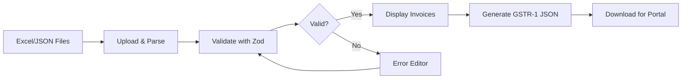
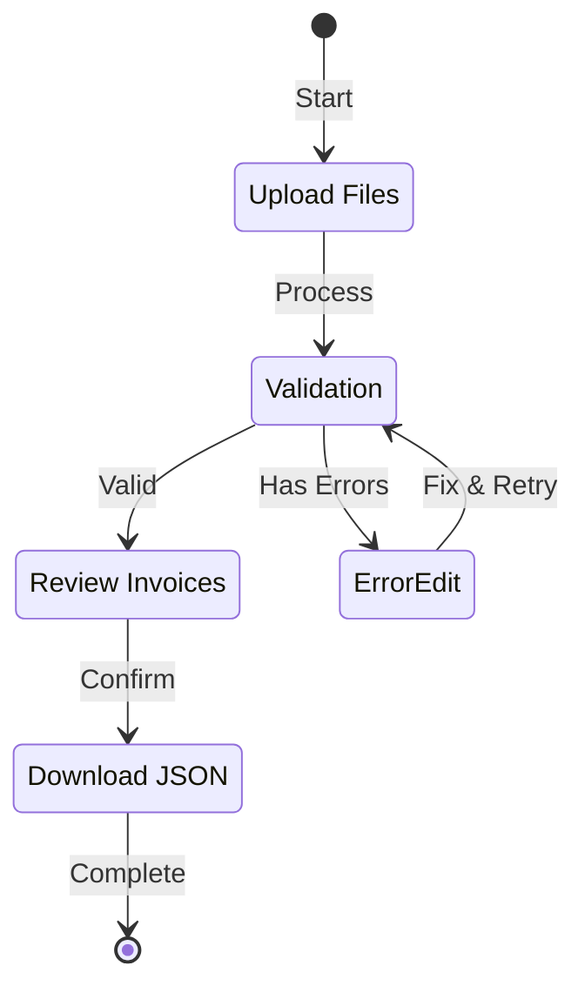

# GST Filing Software - Complete Documentation

## Overview

A **Next.js 16** web application for processing GST (Goods and Services Tax) invoices and generating GSTR-1 compliant JSON files for upload to the Indian GST Portal.



---

## Tech Stack

| Layer | Technology |
|-------|------------|
| Framework | Next.js 16 (App Router) |
| Language | TypeScript |
| State Management | Zustand |
| Validation | Zod |
| Excel Processing | ExcelJS, xlsx-js-style |
| Styling | Tailwind CSS 4 |
| UI Components | Radix UI (shadcn/ui) |
| Charts | Recharts |

---

## Project Structure

```
gst/
├── app/                    # Next.js App Router
│   ├── page.tsx           # Main dashboard (658 lines)
│   ├── layout.tsx         # Root layout with providers
│   └── globals.css        # Tailwind styles
│
├── components/             # React Components
│   ├── ui/                # shadcn/ui primitives
│   ├── invoice-table.tsx  # Invoice display with HSN tooltips
│   ├── invoice-filter.tsx # Filter by party, status, date
│   ├── tax-summary.tsx    # Tax breakdown charts
│   ├── error-details.tsx  # Error display with actions
│   ├── error-editor.tsx   # Edit invalid rows
│   ├── file-dropzone.tsx  # File upload area
│   ├── json-comparator.tsx# Compare two JSON files
│   └── print-summary.tsx  # Print-ready summary
│
├── lib/
│   ├── data/              # HSN/SAC Master Data
│   │   ├── hsn-master.ts  # Unified lookup (main)
│   │   ├── hsn-chapters.ts# 99 HSN chapters
│   │   ├── hsn-headings*.ts# 680+ headings (4 files)
│   │   └── sac-master.ts  # 300+ service codes
│   │
│   ├── schemas/           # Zod Validation Schemas
│   │   ├── gst-schema.ts  # B2B invoice schema
│   │   └── cdnr-schema.ts # Credit/Debit note schema
│   │
│   └── services/          # Business Logic
│       ├── excel-processor.ts  # Parse Excel files
│       ├── excel-export.ts     # Export to Excel
│       ├── json-parser.ts      # Parse JSON files
│       └── processors/
│           ├── b2b-processor.ts
│           └── cdnr-processor.ts
│
├── store/
│   └── gst-store.ts       # Zustand global state
│
└── templates/
    └── gstr1_hsn_master.xlsx  # Excel template
```

---

## Core Features

### 1. File Upload & Processing

**Supported Formats:**
- Excel files (`.xlsx`, `.xls`)
- JSON files (previously exported GSTR-1)

**Processing Flow:**
```typescript
// lib/services/excel-processor.ts
processExcelFile(file, type: 'B2B' | 'CDNR')
  → parseExcel()           // Read file with ExcelJS
  → normalizeHeaders()     // Map varied headers to schema fields
  → processor.validate()   // Validate each row with Zod
  → processor.group()      // Group rows into invoices
  → return { invoices, errors, summary }
```

### 2. Return Types Supported

| Type | Description | Schema |
|------|-------------|--------|
| **B2B** | Business-to-Business invoices | `gst-schema.ts` |
| **CDNR** | Credit/Debit Notes (Registered) | `cdnr-schema.ts` |

### 3. Validation

Uses **Zod** for strict validation:

```typescript
// lib/schemas/gst-schema.ts
B2BInvoiceRowSchema = z.object({
  gstin: z.string().regex(GSTIN_REGEX),     // 15-char GSTIN
  invoiceNumber: z.string().max(16),
  invoiceDate: z.string().regex(/DD-MM-YYYY/),
  invoiceValue: z.number().positive(),
  placeOfSupply: z.string().regex(/^\d{2}$/), // State code
  rate: z.number().refine(val => [0,5,12,18,28].includes(val)),
  taxableValue: z.number().positive(),
  // ... tax amounts, HSN, etc.
})
```

### 4. HSN/SAC Code Master

**Hierarchical Lookup System:**

| Level | Digits | Example | Description |
|-------|--------|---------|-------------|
| Chapter | 2 | `84` | Machinery |
| Heading | 4 | `8471` | Computers |
| Sub-heading | 6 | `847130` | Laptops |
| Tariff | 8 | `84713010` | Personal computers |

**Key Functions:**
```typescript
import { getHSNDescription, getHSNGSTRate, getHSNHierarchy } from '@/lib/data/hsn-master'

getHSNDescription("84821090")  // "Other ball bearings"
getHSNGSTRate("870321")        // 28
getHSNHierarchy("847130")      // { chapter, heading, subheading, gstRate }
```

### 5. GSTR-1 JSON Generation

Generates portal-compliant JSON with:
- **B2B Section** - Grouped by recipient GSTIN
- **HSN Summary** - Aggregated by HSN code and rate
- **Document Issue Summary** - Invoice range statistics

```typescript
// store/gst-store.ts → downloadJSON()
generateGSTR1JSON(gstin, filingPeriod)
// Produces format matching GST Portal requirements
```

### 6. Error Handling & Editing

- Invalid rows are captured with specific error messages
- Users can **edit** errors inline and re-validate
- Or **discard** invalid rows

---

## State Management

Uses **Zustand** with mode-aware selectors:

```typescript
// store/gst-store.ts
interface GSTStore {
  currentStep: 1 | 2 | 3 | 4          // Workflow step
  returnType: 'B2B' | 'CDNR'          // Current mode
  b2bInvoices: B2BInvoice[]           // Valid B2B
  cdnrInvoices: CDNRInvoice[]         // Valid CDNR
  b2bErrors: ErrorRow[]               // B2B errors
  cdnrErrors: ErrorRow[]              // CDNR errors
  
  // Actions
  addFiles(files: File[])
  processFiles(): Promise<void>
  downloadJSON(gstin, period)
  updateErrorRow(index, data): boolean
  reset()
}
```

**Selector Hooks:**
```typescript
useCurrentStep()        // Current workflow step
useReturnType()         // 'B2B' or 'CDNR'
useCurrentInvoices()    // Invoices for current mode
useErrors()             // Errors for current mode
useValidationSummary()  // { total, valid, error }
```

---

## Workflow Steps



| Step | Name | Description |
|------|------|-------------|
| 1 | Upload | Drag & drop Excel/JSON files |
| 2 | Validate | Parse, validate, group invoices |
| 3 | Review | View invoices, filter, edit errors |
| 4 | Download | Generate GSTR-1 JSON for portal |

---

## Key Components

### Dashboard (`app/page.tsx`)
Main interface with:
- Metric cards (total, valid, errors, tax)
- Invoice table with filtering
- Tax summary charts
- Download modal

### Invoice Table (`components/invoice-table.tsx`)
Displays invoices with:
- Sortable columns
- HSN code tooltips (uses `getHSNDescription`)
- Status badges (valid/error/duplicate)

### Tax Summary (`components/tax-summary.tsx`)
Charts showing:
- CGST/SGST/IGST breakdown
- Tax by rate slab
- Party-wise summary

### JSON Comparator (`components/json-comparator.tsx`)
Compare two GSTR-1 JSON files to find:
- Missing invoices
- Value differences
- Added/removed entries

---

## Excel Template

Located at `templates/gstr1_hsn_master.xlsx`

**Required Columns:**
| Column | Field | Required |
|--------|-------|----------|
| GSTIN of Recipient | gstin | ✅ |
| Invoice No. | invoiceNumber | ✅ |
| Invoice Date | invoiceDate | ✅ |
| Invoice Value | invoiceValue | ✅ |
| Place of Supply | placeOfSupply | ✅ |
| Rate (%) | rate | ✅ |
| Taxable Value | taxableValue | ✅ |
| HSN Code | hsnCode | Optional |
| IGST/CGST/SGST Amt | amounts | Optional |

---

## Getting Started

```bash
# Install dependencies
npm install

# Run development server
npm run dev

# Build for production
npm run build
```

---

## API Reference

### HSN Master Functions

| Function | Description | Returns |
|----------|-------------|---------|
| `getHSNDescription(code)` | Get code description | `string` |
| `getHSNGSTRate(code)` | Get applicable GST rate | `number \| undefined` |
| `getHSNHierarchy(code)` | Full breakdown | `{ chapter, heading, ... }` |
| `isValidHSNCode(code)` | Validate code exists | `boolean` |
| `searchHSNByDescription(keyword)` | Search by description | `HSNEntry[]` |

### Store Actions

| Action | Description |
|--------|-------------|
| `addFiles(files)` | Add files to process |
| `processFiles()` | Parse and validate all files |
| `downloadJSON(gstin, period)` | Generate and download GSTR-1 |
| `updateErrorRow(index, data)` | Fix an error row |
| `removeError(index)` | Discard an error row |
| `reset()` | Clear all state |

---

## File Sizes

| File | Size | Purpose |
|------|------|---------|
| `app/page.tsx` | 29KB | Main dashboard |
| `gst-store.ts` | 20KB | State management |
| `hsn-master.ts` | 24KB | Unified HSN lookup |
| `sac-master.ts` | 35KB | Service codes |
| `excel-processor.ts` | 15KB | Excel parsing |
| `excel-export.ts` | 17KB | Excel export |

---

## License

Private application for GST filing purposes.
